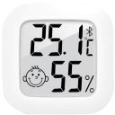

# blelt2mqtt : Bluetooth LE LT Thermometer 2 MQTT

This software is a simple gateway to publish on MQTT for use with [Home Assistant](https://www.home-assistant.io/) or [Domoticz](https://www.domoticz.com/) temperature data from cheap bluetooth sensor LT Thermometer


## Supported devices

| Device | Photo | Where to find (examples) |
| :-: |  :-: |  - | 
| LT Thermometer v3 |  | [AliExpress](https://fr.aliexpress.com/item/1005004073828412.html) |

These devices are supported by an android application named "qaqa" which is available here : https://d.ihunuo.com/app/dqwu (LT-Thermometer v3.apk)


## Install

Prerequisites:
* Linux, Windows or MacOS (only tested on Linux / Raspberry Pi and Windows 11)
* Bluetooth LE compatible device (with installed stack)
* Python3 with pip3

Installation steps:  
1. **Optional**: Create a virtual environment (venv)  

Debian users will need to install `python-venv` first if not installed! Python will warn you about that.

First, create a virtual environment:

```bash
# Create the venv
python3 -m venv .venv
# Activate the venv
source .venv/bin/activate
```

To be sure, let's first upgrade PIP in our fresh venv:
```bash
python3 -m pip install --upgrade pip
```

2. Install needed Python modules (bleak, paho-mqtt)

```
pip3 install -r requirements.txt
```

3. Configure your sensor and MQTT server in the configuration file

4. To ensure the software is launched at startup :

```
crontab -e

@reboot bash /path/to/blelt.sh
```

## Configure Domoticz / Home Assistant

This should not require extra configuration for use with MQTT auto-discovery.

### Domoticz

If you want to have a domoticz sensor with temperature and humidity, you need to follow these steps:
1. Configure a virtual sensor Temperature+Humidity through the Dummy hardware in Hardware menu
2. Read the idx of the created device in the Devices menu
3. Add the idx in the configuration file as 'domoticz_idx'

You should now see the sensor (native sensor on the left, auto-discovered on the right) :


### Home Assistant

By default, the auto-discovered device is a MQTT device with the components **temperature**, **humidity** 
and **battery**.  

#### Extracting attributes as entities

In case you want to extract data from the attributes as separate entities (and possibly manipulate the extracted data)
follow the steps below. This gives an example of manipulating the temperature entity and creating a separate humidity 
entity.

1. Open _configuration.yaml_
2. Add the following. Replace <DEVICE.NAME> with your device's bluetooth name.  
```
# blelt2mqtt sensor example
mqtt:
  - sensor:
    - name: "My Area - Temperature"
      state_topic: "lt_temp/<DEVICE.NAME>>/state"
      suggested_display_precision: 1
      unit_of_measurement: "°C"
      value_template: "{{ value_json.temperature }}"
    - name: "My Area - Humidity"
      state_topic: "lt_temp/<DEVICE.NAME>/state"
      unit_of_measurement: "%"
      value_template: "{{ value_json.humidity }}"
```
3. Check the configuration and reload Home Assistant.

#### Using sensor cards
1. Edit dashboard
2. Add to dashboard > by card
3. Choose **Sensor**
4. Configure the sensor data you want to display as desired.


## Protocol

The reverse-engineered protocol is described in [protocol.md](./protocol.md) and the process is described in this [article (in french)](https://www.lprp.fr/2022/07/capteur-bluetooth-le-temperature-dans-domoticz-par-reverse-engineering-et-mqtt-auto-discovery-domoticz-et-home-assistant/)


## Useful links

* [LT-Thermometer v3](https://d.ihunuo.com/app/dqwu) Android or iOS application
* Bluetooth UUID [Nordic open database](https://github.com/NordicSemiconductor/bluetooth-numbers-database) and [official 16-bits list](https://btprodspecificationrefs.blob.core.windows.net/assigned-values/16-bit%20UUID%20Numbers%20Document.pdf) <i>(spoiler: the used UUID aren't in there...)</i>
* [BLE Tutorial for Arduino](https://www.sgwireless.com/uploads/ueditor/upload/file/20200315/AN-101%20Enabling%20BLE%20function%20on%20Arduino%20Platform%20with%20SGW1010-EVK.pdf)
* Home Assistant [auto-discovery protocol](https://www.home-assistant.io/docs/mqtt/discovery/) and [fields definition for sensors](https://www.home-assistant.io/integrations/sensor.mqtt/), specifically 
[Temperature and Humidity Sensors](https://www.home-assistant.io/integrations/sensor.mqtt/#temperature-and-humidity-sensors)
* Domoticz auto-discovery support with [native client](https://www.domoticz.com/wiki/MQTT#Add_hardware_.22MQTT_Auto_Discovery_Client_Gateway.22) or [plugin](https://github.com/emontnemery/domoticz_mqtt_discovery)
* Domoticz MQTT [sensor messages format](https://piandmore.wordpress.com/2019/02/04/mqtt-out-for-domoticz/)


## License & Credits

[GPL-3.0 
](LICENSE)

2022 - Remi Peyronnet  

Contributions:  
Maghiel Dijksman